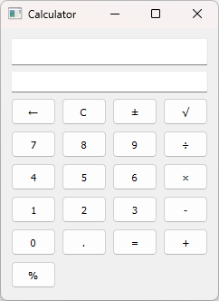

# Simple Calculator with PyQt5

This project is a simple calculator implemented using the PyQt5 library in Python. The calculator supports basic arithmetic operations and has a graphical user interface.



## Features

- Performs addition, subtraction, multiplication, division, square root, percentage, and negation operations.
- Supports keyboard input for ease of use.
- Displays both the equation and result in separate fields.

## Dependencies

To run the calculator, you need the following libraries:

- PyQt5
- Python 3.x

## Installation

1. Make sure you have Python 3.x installed. If not, [download and install Python](https://www.python.org/downloads/).
2. Install the PyQt5 library by running:
   ```
   pip install PyQt5
   ```

## Usage

- Use both mouse clicks and keyboard input to enter numbers and operations.
- Operation buttons include:
  - `+` for addition
  - `-` for subtraction
  - `*` for multiplication
  - `/` for division
  - `√` for square root
  - `±` for negation
  - `%` for percentage
  - `C` to clear current input
  - `←` to delete the last character

## Running the Calculator

1. Download the source code of the calculator.
2. Open a terminal (command prompt) in the directory containing the source code.
3. Launch the calculator by running:
   ```
   python calс.py
   ```

## License

This project is licensed under the [MIT License](link to the license).
